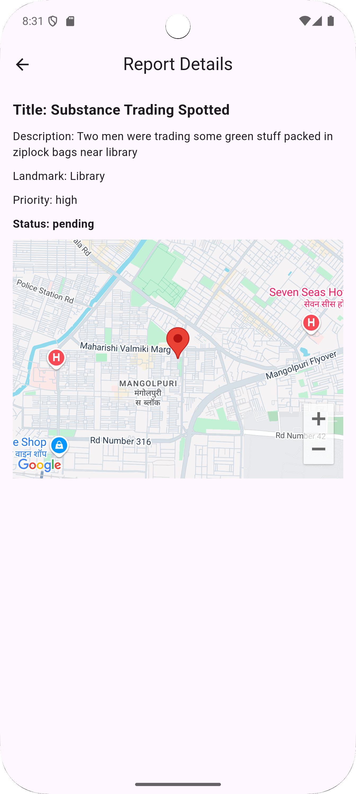

# 🛡️ UniGuard – A Secure & Anonymous Reporting Platform

**UniGuard** is a mobile application built using Flutter and Firebase that empowers students to anonymously report substance abuse-related incidents within university campuses. It offers real-time updates, AI-powered assistance, and mental health resources to promote a safe and supportive environment.

## 📲 Features

- ✅ **Anonymous Reporting** (Firebase Anonymous Auth)
- ✅ **Location-Based Reporting** (Google Maps API)
- ✅ **Real-Time Report Status Tracking** (Firebase Firestore)
- ✅ **Smart AI Support** (Gemini AI Chatbot)
- ✅ **Access to Mental Health Resources**
- ✅ **One-Click Counseling Booking via Google Meet**
- 🛡️ **Hidden Admin Login (5-Tap Easter Egg)**

---

## 🔍 Why UniGuard?

🔐 **Privacy First**  
Students can report without fear of retaliation using unique ID-based anonymous login.

🗺️ **Precise Reporting**  
Pinpoint exact incident locations using Google Maps integration.

🤖 **AI Insights**  
Gemini AI acts as a chatbot for users.

🕒 **Live Updates**  
Stay informed with real-time updates and auto-generated safety recommendations.

💬 **Support at Fingertips**  
Access mental health self-help resources or book a Google Meet counseling session directly through the app.

---

## 🔑 Admin Easter Egg Login

An Easter Egg Admin Panel is hidden inside the app!
Tap five times on the login screen title to reveal a secure email/password login page meant for administrators.

🔐 Used to access advanced moderation tools (e.g., viewing all reports, discarding fake content, updating status).

🔒 Credentials required are stored securely and not exposed publicly.

🛡️ Ensures student data remains protected while enabling safe internal moderation.

> email : test@abc.com
> password : 123456

🔒 Credentials for admin login.

---

## 🛠️ Tech Stack

| Layer             | Technology Used             |
|------------------|-----------------------------|
| **Frontend**      | Flutter                     |
| **Backend**       | Firebase Firestore          |
| **Authentication**| Firebase Anonymous Auth     |
| **Maps**          | Google Maps API             |
| **AI Chat & Analysis** | Gemini API              |
| **Video Meet**    | Google Meet API             |

---

## 🌐 SDG Alignment

UniGuard supports several **UN Sustainable Development Goals**, especially in promoting **Good Health & Well-being (SDG 3)** and **Peace, Justice & Strong Institutions (SDG 16)**.

---

## 📸 Snapshots

  
  
  

  
  
  

  
  
  

  
  
  

  
  
  

  
  
  

  
  
  

  
  
  

  
  
  

  
  

---

## 📁 Repository Links

- 🔗 **GitHub Repository:** [https://github.com/Gayatri018/UniGuard](https://github.com/Gayatri018/UniGuard)
- 🎥 **Demo Video:** [https://youtu.be/4TCZnYTbONQ?feature=shared](https://youtu.be/4TCZnYTbONQ?feature=shared)
- 📦 **MVP Download:** [Releases Page](https://github.com/Gayatri018/UniGuard/releases)

---

## 👥 Team Codifyy

- **Team Members:** [Gayatri Deshmukh](https://github.com/Gayatri018) and [Krishna Kothawale](https://github.com/KrishnaKothawale)
- Built with ❤️ by passionate developers for a safer campus.

---

> _Empowering students. Promoting mental wellness. Reporting made safe and simple._ 🚨
